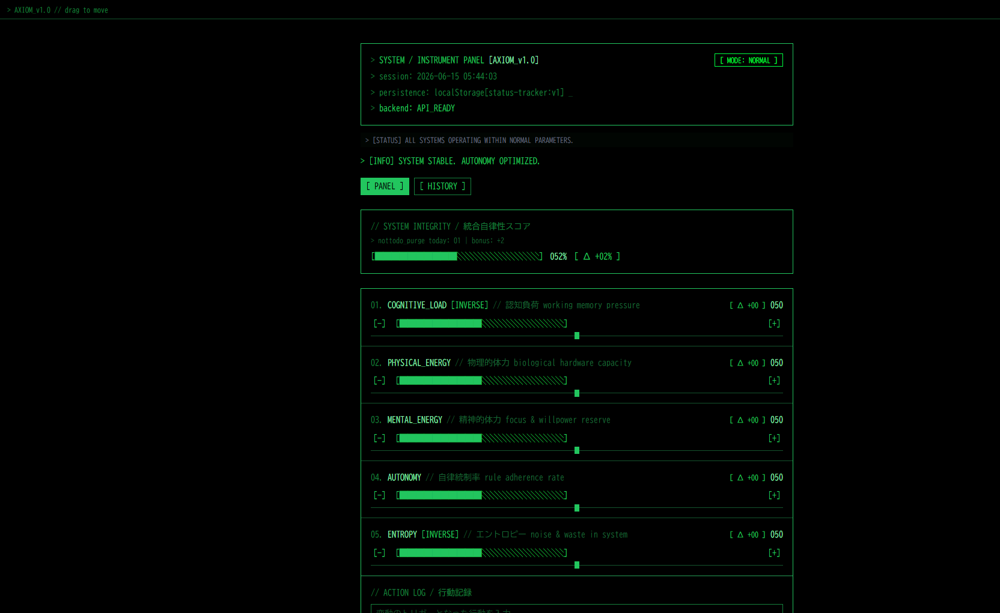

# AXIOM

Personal system monitor — track five biometrics-style metrics, compute **SYSTEM INTEGRITY**, and persist logs locally with optional LLM enrichment.



## Overview

AXIOM is a CLI-aesthetic instrument panel for daily self-state tracking. It combines:

- **5 metrics** (0–100): Cognitive Load, Physical Energy, Mental Energy, Autonomy, Entropy
- **SYSTEM INTEGRITY** — non-linear scoring with Safe Mode (graceful degradation) and Not-To-Do purge bonus
- **FastAPI + SQLite** backend for logs and events
- **History analytics** — time-series charts, correlation scatter, CSV export
- **Local LLM (Mimi / Nana)** — optional note enrichment and Safe Mode rationale via LM Studio

| Screenshot | Description |
|---|---|
| [Panel](docs/screenshots/panel.png) | Main instrument panel |
| [History](docs/screenshots/history.png) | Log timeline and charts |
| [Safe Mode](docs/screenshots/safe-mode.png) | Graceful degradation toggle |

## Tech Stack

| Layer | Stack |
|---|---|
| Frontend | React 18, TypeScript, Vite, Tailwind CSS, Recharts |
| Desktop | Tauri 2 (Rust), frameless transparent window |
| Mobile | Capacitor 8 (Android) |
| Backend | FastAPI, SQLAlchemy, SQLite |
| LLM | LM Studio (OpenAI-compatible API), httpx async client |

## Quick Start

### Web (development)

```powershell
cd backend
python -m venv .venv
.\.venv\Scripts\pip install -r requirements.txt
.\.venv\Scripts\uvicorn main:app --reload --port 8000

# separate terminal
npm install
npm run dev
```

Open http://localhost:5173

### Desktop (Tauri)

```powershell
npm run tauri dev
```

### Production build

```powershell
npm run tauri build
```

Installer output: `src-tauri/target/release/bundle/`

## Architecture

```
React UI (Vite)
    │  REST /api/logs, /api/events, /api/health, /api/llm/*
    ▼
FastAPI + SQLite (axiom.db)
    │  BackgroundTasks → Mimi enrichment (optional)
    ▼
LM Studio :1234 (local, optional)
```

Tauri bundles the Python backend under `src-tauri/resources/backend/` via `scripts/prepare-backend-bundle.ps1`.

## Key Features

- **Safe Mode** — disables non-linear penalties when system resources are depleted
- **COMMIT** — snapshot current metrics + note to SQLite
- **PURGE (Not-To-Do)** — log discarded tasks; counts toward integrity bonus
- **Mimi** — structures free-text notes into `{ trigger, category, impact[] }`
- **Nana** — generates Safe Mode rationale text from current metrics

## Repository

https://github.com/aksunknk/axiom

## License

Private / personal project.
